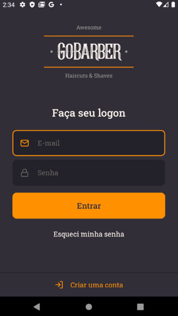
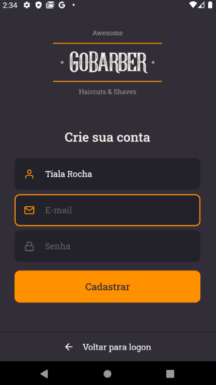
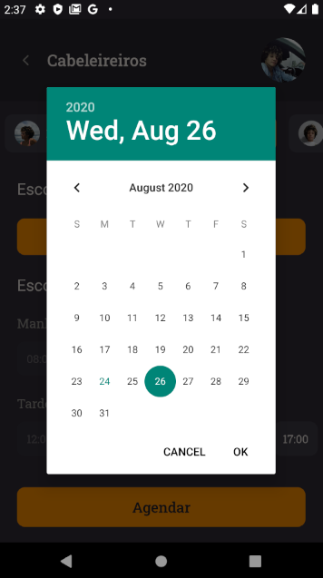

# 🚀 GoBarber Mobile
Mobile project to schedule customer service at a barber shop. Created during my journey at Rocketseat's Bootcamp. Developed with React Native.

This application allows customers (in this case users who wish to receive assistance related to the barber shop in question) 
in the scope of authentication to perform the login, registration and password recovery

Within the application it is possible for customers to view the service providers 
in the barbershop and make an appointment for a specific date and time.

The service providers are presented in a list, as well as their respective schedules available for appointments.

The user can also change his registration data and insert an avatar to his profile.

 

 _&nbsp;&nbsp;_  
 

 _&nbsp;&nbsp;&nbsp;_ 
 

 _&nbsp;&nbsp;&nbsp;_  
 

 _&nbsp;&nbsp;&nbsp;_ 
